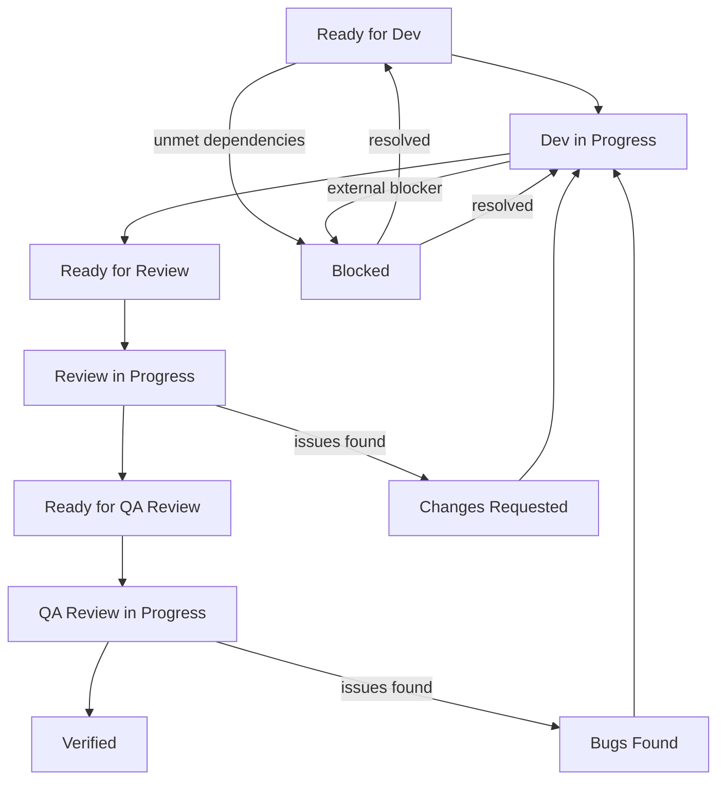

# Task Performer Plugin

Structured development workflow plugin for Claude Code with automated code review and QA verification for mobile applications.

## Overview

Task Performer is a Claude Code plugin that orchestrates a complete development workflow for Android projects. It provides specialized agents and skills to handle:

- **Development** - Implementation of features following best practices
- **Code Review** - Comprehensive code analysis with actionable feedback
- **QA Verification** - Build, tests, coverage, security, and accessibility checks

## Installation

In Claude Code, register the marketplace first:
`/plugin marketplace add memksim/workflow-marketplace`

Then install the plugin from this marketplace:
`/plugin install taREDACTED__N31__

### Directory Structure

After installation, your project should have:

```
your-project/
└── .claude/
    └── tasks/
        └── <TASK-ID>/
            ├── task.md
            ├── dev_result.md
            ├── review_result.md
            └── qa_review_result.md
```

## Agents

### senior-android-developer

Senior Android developer agent for:
- Architecture decisions (MVI, MVVM, Clean Architecture)
- Kotlin/Java implementation
- Jetpack Compose UI development
- Performance optimization
- Testing strategies

### android-code-reviewer

Code review specialist that analyzes:
- Architecture compliance
- Code style and conventions
- Bug detection (NPE, memory leaks, race conditions)
- Security vulnerabilities

### qa-expert

Quality assurance agent that verifies:
- Build status (debug/release)
- Autotest execution and results
- Test coverage analysis
- Security audit (OWASP Mobile Top 10)
- Accessibility compliance (WCAG 2.1 AA)

## Skills

### /make_task

Creates a new task with the specified ID.

```
/make_task ABC-123
```

### /perform_task

Executes the full workflow for a task.

```
/perform_task ABC-123
```

### /list_tasks

Lists all tasks with optional filtering.

```
/list_tasks status=ready_for_dev priority=1,2
/list_tasks blocked=true
```

### /task_info

Shows detailed information about a specific task.

```
/task_info CORE-001
```

Displays: full task card, history, artifacts, status badges.

### /status

Shows project dashboard with task counts, active work, and blocked items.

```
/status
/status detailed=true
/status team=true
```

## Workflow

### Status Flow



### Status Definitions

| Status | Description |
|--------|-------------|
| `Ready for dev` | Task waiting for developer to pick it up |
| `Dev in progress` | Developer has picked up the task |
| `Ready for review` | Developer completed work, waiting for code review |
| `Review in progress` | Code reviewer has picked up the task |
| `Changes requested` | Code review found issues, returned to development |
| `Ready for QA review` | Code reviewer completed, waiting for QA |
| `QA review in progress` | QA has picked up the task |
| `Bugs found` | QA found issues, returned to development |
| `Verified` | Work on task is completed |
| `Blocked` | Task is blocked by dependencies or external factors |

## Task Format

Tasks are **Markdown files** (`.md`) with **YAML frontmatter** at the top:

```markdown
---
id: "TASK-001"
title: "Short task title"
type: feature
priority: 2
assignee: senior-android-developer
depends_on: []
blocks: []
created_at: "2026-03-05T10:00:00Z"
updated_at: "2026-03-05T10:00:00Z"
status: "Ready for dev"
attempt: 0
---

# TASK-001: Short task title

## Problem Statement
What problem needs to be solved.

## Task Description
What needs to be done.

## Constraints
- Constraint 1
- Constraint 2

## Acceptance Criteria
- [ ] Criterion 1
- [ ] Criterion 2

## Team Specification

| Role | Agent |
|------|-------|
| Developer | senior-android-developer |
| Reviewer | android-code-reviewer |
| QA | qa-expert |

## Status: Ready for dev
## Updated: 2026-03-05 10:00:00
```

### Task Fields

| Field | Type | Description |
|-------|------|-------------|
| id | string | Unique task identifier |
| title | string | Short task title |
| type | enum | feature, bug, refactor, research, docs |
| priority | number | 1-4 (Critical, High, Medium, Low) |
| assignee | string | Agent assigned to task |
| depends_on | array | Tasks that must complete first |
| blocks | array | Tasks waiting for this task |
| status | string | Current task status |

### Priority Levels

| Priority | Name | SLA | Description |
|----------|------|-----|-------------|
| 1 | Critical | Today | Blocking production or critical path |
| 2 | High | This week | Important feature or significant bug |
| 3 | Medium | This sprint | Regular feature or improvement |
| 4 | Low | When possible | Nice-to-have or minor improvement |

## Task Files

Each task generates several files:

| File | Purpose |
|------|---------|
| `task.md` | Task description and status |
| `dev_result.md` | Development results |
| `review_result.md` | Code review findings |
| `qa_review_result.md` | QA verification results |
| `task_history.md` | History of status changes (optional) |

## Dependencies

Tasks can depend on other tasks using `depends_on`:

```yaml
depends_on: ["AUTH-001", "AUTH-002"]
```

A task with unmet dependencies will be set to `Blocked` status automatically.

### Dependency Rules

- Task cannot start if any dependency is not `Verified`
- Circular dependencies are not allowed
- When task becomes `Verified`, dependent tasks are automatically unblocked

## Examples

Example files are available in the `skills/*/examples/` directories.

## License

MIT License - see [LICENSE](LICENSE) for details.
