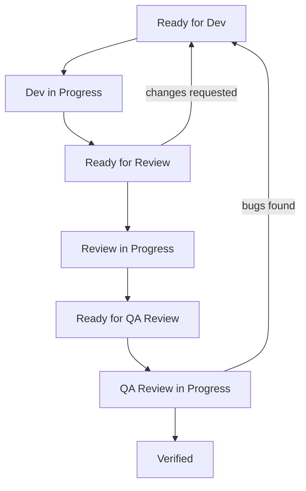

# Task Performer Plugin

Structured development workflow plugin for Claude Code with automated code review and QA verification for mobile applications.

## Overview

Task Performer is a Claude Code plugin that orchestrates a complete development workflow for Android projects. It provides specialized agents and skills to handle:

- **Development** - Implementation of features following best practices
- **Code Review** - Comprehensive code analysis with actionable feedback
- **QA Verification** - Build, tests, coverage, security, and accessibility checks

## Installation

In Claude Code, register the marketplace first:
`/plugin marketplace add memksim/workflow-marketplace`

Then install the plugin from this marketplace:
`/plugin install task-performer@workflow-plugins`

### Directory Structure

After installation, your project should have:

```
your-project/
└── .claude/
    └── tasks/
        └── <TASK-ID>/
            ├── task.md
            ├── dev_result.md
            ├── review_result.md
            └── qa_review_result.md
```

## Agents

### senior-android-developer

Senior Android developer agent for:
- Architecture decisions (MVI, MVVM, Clean Architecture)
- Kotlin/Java implementation
- Jetpack Compose UI development
- Performance optimization
- Testing strategies

### android-code-reviewer

Code review specialist that analyzes:
- Architecture compliance
- Code style and conventions
- Bug detection (NPE, memory leaks, race conditions)
- Security vulnerabilities

### qa-expert

Quality assurance agent that verifies:
- Build status (debug/release)
- Autotest execution and results
- Test coverage analysis
- Security audit (OWASP Mobile Top 10)
- Accessibility compliance (WCAG 2.1 AA)

## Skills

### /make_task

Creates a new task with the specified ID.

```
/make_task ABC-123
```

Prompts for:
- Title
- Problem description
- Task description
- Constraints
- Team members

Creates `.claude/tasks/ABC-123/task.md` with status `Ready for dev`.

### /perform_task

Executes the full workflow for a task.

```
/perform_task ABC-123
```

Runs the complete pipeline(Unless otherwise stated in the task description):
1. **Development** - `senior-android-developer` implements the feature
2. **Code Review** - `android-code-reviewer` analyzes the code
3. **QA Verification** - `qa-expert` checks build, tests, security, accessibility

## Workflow

### User workflow
1. `/make_task ABC-123`
2. `/perform_task ABC-123`

### Agents workflow


## Task Files

Each task generates several files:

| File | Purpose |
|------|---------|
| `task.md` | Task description and status |
| `dev_result.md` | Development results |
| `review_result.md` | Code review findings |
| `qa_review_result.md` | QA verification results |

## Examples

Example files are available in the `skills/*/examples/` directories.

## License

MIT License - see [LICENSE](LICENSE) for details.