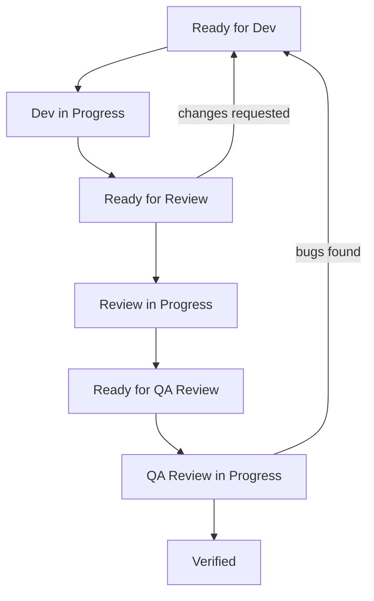

## What is a task
Each task is a directory with a name equal to the unique task identifier.
**Examples:**
```
1) Identifier: MUSIC-009 -> Directory .claude/tasks/MUSIC-009/
2) Identifier: FEED-1000 -> Directory .claude/tasks/FEED-1000/
```

As mentioned earlier, a task is a directory. It contains a set of .md files. Their set may vary.
**Example:**
- task.md - the only mandatory and guaranteed file in a task. Others are optional
- dev_result.md
- code_review_result.md
- qa_review_result.md
- manual_qa_result.md

## task.md
File containing main task information:
- Task identifier
- Title
- Problem
- Task - what needs to be done
- Constraints
- Team - which subagents will be included in the work
- Status - task status. _More about them below_.

> Important: This file is always guaranteed to exist. If it's not there - require the user to create it.

### Task status
Task status shows progress of each performer:
- `Ready for dev` - Task waiting for developer to pick it up.
- `Dev in progress` - Developer has picked up the task.
- `Ready for review` - Developer has completed work on task. Task waiting for code review.
- `Review in progress` - Code reviewer has picked up the task.
- `Ready for qa review` - Code reviewer has completed work on task. Task waiting for QA to pick it up.
- `QA review in progress` - QA has picked up the task.
- `Verified` - Work on task is completed.

#### Timestamp
> Important: Always put date and time next to task status when setting it

Always specify task completion time strictly in format: YYYY-MM-DD HH:mm:ss (for example, 2026-02-25 10:43:00).
Don't add extra words or explanations before the date.

**Examples:**
- `Ready for dev` - 2026-02-11 10:43:00
- `Verified` - 2025-12-24 18:15:43

#### Status workflow process


### For performers
#### Main agent
Monitors statuses and calls corresponding performers.
- `Ready for dev` - calls `android-developer` agent.
- `Ready for review` - calls `android-code-reviewer` agent.
- `QA review in progress` - calls `qa-expert` agent.
- `Verified` - work finished. Forming response to user.

**Constraints:**
- Main agent is prohibited from setting statuses independently. It can only monitor them and call corresponding agents.
- Prohibited from changing task content
- Prohibited from moving task to other directories

#### android-developer
Only monitors statuses related to development.
If status:
- `Ready for dev` - Sets new status - `Dev in progress`, because task was picked up.
- `Dev in progress` - After completing work, changes to `Ready for review`

**Requirements:**
- Prohibited from changing others' statuses.
- Flow strictly `Ready for dev` -> Start work -> Set `Dev in progress` -> Finish work -> Set status `Ready for review`

#### android-code-reviewer
Only monitors statuses related to code review.
If status:
- `Ready for review` - Sets new status - `Review in Progress`, because task was picked up.
- `Review in Progress`
  - After completing work, if no comments, changes to `Ready for QA Review`
  - After completing work, if there are comments, sets status `Ready for dev`

**Requirements:**
- Prohibited from changing others' statuses.
- Flow strictly `Ready for review` -> Start work -> Set `Review in Progress` -> Finish work -> `Ready for dev` OR `Ready for QA Review`

#### qa-expert
Only monitors statuses related to code review.
If status:
- `Ready for QA Review` - Sets new status - `QA Review in Progress`, because task was picked up.
- `QA Review in Progress`
    - After completing work, if no comments, changes to `Verified`
    - After completing work, if there are comments, sets status `Ready for dev`

**Requirements:**
- Prohibited from changing others' statuses.
- Flow strictly `Ready for QA Review` -> Start work -> Set `QA Review in Progress` -> Finish work -> `Ready for dev` OR `Verified`