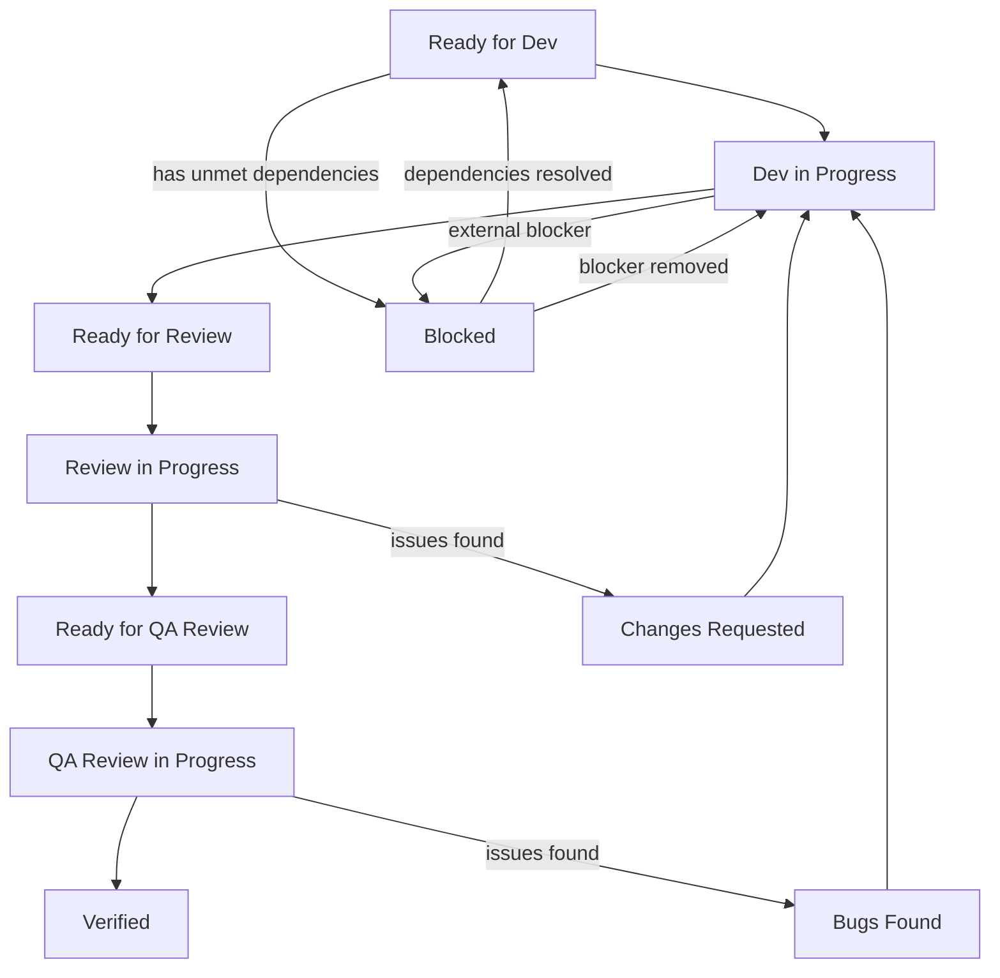

## What is a task
Each task is a directory with a name equal to the unique task identifier.
**Examples:**
```
1) Identifier: MUSIC-009 -> Directory <project_root>/.claude/tasks/MUSIC-009/
2) Identifier: FEED-1000 -> Directory <project_root>/.claude/tasks/FEED-1000/
```

As mentioned earlier, a task is a directory. It contains a set of .md files. Their set may vary.
**Example:**
- task.md - the only mandatory and guaranteed file in a task. Others are optional
- dev_result.md
- code_review_result.md
- qa_review_result.md
- manual_qa_result.md
- task_history.md - history of status changes (optional)

## task.md

Task files are **Markdown files** (`.md`) with **YAML frontmatter** at the top.

The frontmatter (between `---` markers) contains metadata, followed by regular Markdown content:

```markdown
---
id: "TASK-001"
title: "Implement user profile screen"
type: feature              # feature | bug | refactor | research | docs
priority: 2                # 1-4 (1 = Critical, 2 = High, 3 = Medium, 4 = Low)
assignee: senior-android-developer
depends_on: []             # List of task IDs that must complete first
blocks: []                 # List of task IDs waiting for this task
created_at: "2026-03-05T10:00:00Z"
updated_at: "2026-03-05T12:30:00Z"
status: "Ready for dev"
attempt: 0                 # Number of execution attempts
---

# TASK-001: Implement user profile screen

## Problem Statement

What problem needs to be solved and why.

## Task Description

Detailed description of what needs to be done.

## Context

- Links to documentation
- Related files
- Design (Figma)
- Architecture decisions

## Constraints

- Do not touch X
- Use Y pattern
- Backward compatibility requirements

## Acceptance Criteria

- [ ] Criterion 1
- [ ] Criterion 2
- [ ] Criterion 3

## Artifacts

- Source code: src/features/profile/
- Tests: src/test/features/profile/

## Team Specification

| Role | Agent |
|------|-------|
| Developer | senior-android-developer |
| Reviewer | android-code-reviewer |
| QA | qa-expert |

## Status: Ready for dev
## Updated: 2026-03-05 10:00:00
```

### Field Definitions

| Field | Type | Required | Description |
|-------|------|----------|-------------|
| id | string | Yes | Unique task identifier (e.g., CORE-001) |
| title | string | Yes | Short task title |
| type | enum | Yes | One of: feature, bug, refactor, research, docs |
| priority | number | Yes | 1-4 (1=Critical, 2=High, 3=Medium, 4=Low) |
| assignee | string | No | Agent assigned to the task |
| depends_on | array | No | List of task IDs that block this task |
| blocks | array | No | List of task IDs that this task blocks |
| created_at | datetime | Yes | ISO 8601 timestamp |
| updated_at | datetime | Yes | ISO 8601 timestamp |
| status | string | Yes | Current task status |
| attempt | number | No | Number of execution attempts (default: 0) |

> Important: This file is always guaranteed to exist. If it's not there - require the user to create it.

---

## Task Status

Task status shows progress of each performer:

### Core Statuses

| Status | Description |
|--------|-------------|
| `Ready for dev` | Task waiting for developer to pick it up |
| `Dev in progress` | Developer has picked up the task |
| `Ready for review` | Developer completed work, waiting for code review |
| `Review in progress` | Code reviewer has picked up the task |
| `Changes requested` | Code review found issues, task returned to development |
| `Ready for QA review` | Code reviewer completed, waiting for QA |
| `QA review in progress` | QA has picked up the task |
| `Bugs found` | QA found issues, task returned to development |
| `Verified` | Work on task is completed |
| `Blocked` | Task is blocked by dependencies or external factors |

### Priority Levels

| Priority | Name | SLA | Description |
|----------|------|-----|-------------|
| 1 | Critical | Today | Blocking production or critical path |
| 2 | High | This week | Important feature or significant bug |
| 3 | Medium | This sprint | Regular feature or improvement |
| 4 | Low | When possible | Nice-to-have or minor improvement |

### Timestamp
> Important: Always put date and time next to task status when setting it

Always specify task completion time strictly in format: YYYY-MM-DD HH:mm:ss (for example, 2026-02-25 10:43:00).
Don't add extra words or explanations before the date.

**Examples:**
- `Ready for dev` - 2026-02-11 10:43:00
- `Verified` - 2025-12-24 18:15:43

### Status Workflow



### Blocked Status

Task enters `Blocked` status when:
1. `depends_on` contains a task ID that is not `Verified`
2. External blocker exists (no API access, waiting for response, etc.)

Task exits `Blocked` status when:
1. All tasks in `depends_on` are `Verified`
2. External blocker is removed manually via `/unblock_task`

---

## Dependencies

### depends_on

Specifies tasks that must complete before this task can start.

```yaml
depends_on:
  - "CORE-001"
  - "CORE-002"
```

**Rules:**
- Task cannot transition from `Ready for dev` to `Dev in progress` if any dependency is not `Verified`
- If dependencies are not met, task goes to `Blocked` status
- Circular dependencies are not allowed

### blocks

Specifies tasks that are waiting for this task to complete.

```yaml
blocks:
  - "CORE-005"
  - "CORE-006"
```

**Rules:**
- Automatically populated when another task has this task in its `depends_on`
- Used for impact analysis when blocking a task

### Dependency Validation

Before starting work on a task:
1. Check all tasks in `depends_on`
2. If any task is not `Verified`:
   - Set status to `Blocked`
   - Record blocker reason in task
3. If all dependencies are `Verified`:
   - Allow task to proceed

---

## Task History (Optional)

File `task_history.md` tracks all status changes:

```markdown
## History

| Date | Status | Actor | Comment |
|------|--------|-------|---------|
| 2026-03-05 10:00 | Ready for dev | User | Task created |
| 2026-03-05 10:30 | Dev in progress | senior-android-developer | Started development |
| 2026-03-05 14:00 | Ready for review | senior-android-developer | Implementation complete |
| 2026-03-05 14:30 | Blocked | android-code-reviewer | Waiting for API docs |
| 2026-03-05 15:00 | Ready for review | User | Blocker removed |
```

---

## For Performers

### Main Agent
Monitors statuses and calls corresponding performers.
- `Ready for dev` - calls `android-developer` agent (after checking dependencies)
- `Ready for review` - calls `android-code-reviewer` agent
- `Changes requested` - calls `android-developer` agent to address review feedback
- `Ready for QA review` - calls `qa-expert` agent
- `Bugs found` - calls `android-developer` agent to fix bugs
- `Verified` - work finished. Forming response to user
- `Blocked` - notify user about blocker

**Constraints:**
- Main agent is prohibited from setting statuses independently. It can only monitor them and call corresponding agents.
- Prohibited from changing task content
- Prohibited from moving task to other directories
- Must check `depends_on` before allowing task to start

### android-developer
Only monitors statuses related to development.
If status:
- `Ready for dev` - Sets new status - `Dev in progress`, because task was picked up.
- `Dev in progress` - After completing work, changes to `Ready for review`
- `Changes requested` - Task returned after review, sets status to `Dev in progress` and continues work
- `Bugs found` - Task returned after QA, sets status to `Dev in progress` and fixes bugs
- `Blocked` (if was in progress) - Record blocker, notify main agent

**Requirements:**
- Prohibited from changing others' statuses.
- Flow strictly `Ready for dev` -> Start work -> Set `Dev in progress` -> Finish work -> Set status `Ready for review`
- For rework: `Changes requested` or `Bugs found` -> Set `Dev in progress` -> Fix issues -> Set status `Ready for review`

### android-code-reviewer
Only monitors statuses related to code review.
If status:
- `Ready for review` - Sets new status - `Review in Progress`, because task was picked up.
- `Review in Progress`
  - After completing work, if no comments, changes to `Ready for QA Review`
  - After completing work, if there are comments, sets status `Changes requested`

**Requirements:**
- Prohibited from changing others' statuses.
- Flow strictly `Ready for review` -> Start work -> Set `Review in Progress` -> Finish work -> `Changes requested` OR `Ready for QA Review`

### qa-expert
Only monitors statuses related to QA review.
If status:
- `Ready for QA Review` - Sets new status - `QA Review in Progress`, because task was picked up.
- `QA Review in Progress`
    - After completing work, if no comments, changes to `Verified`
    - After completing work, if there are comments, sets status `Bugs found`

**Requirements:**
- Prohibited from changing others' statuses.
- Flow strictly `Ready for QA Review` -> Start work -> Set `QA Review in Progress` -> Finish work -> `Bugs found` OR `Verified`
